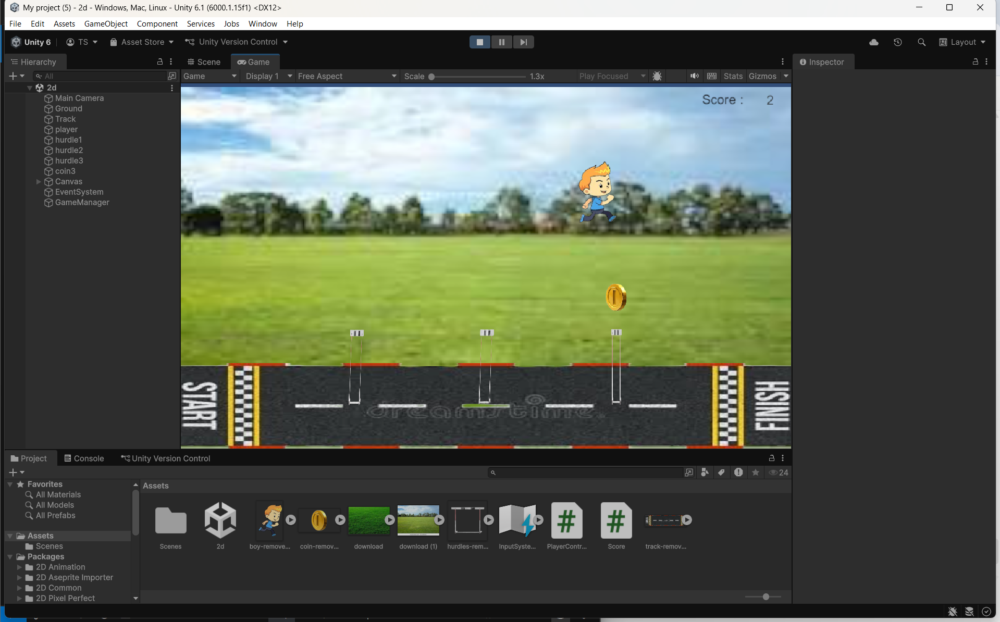

# Ex3---Hurdle-Game-2D

## AIM:
To create a 2D player control system in Unity that allows a player to move, jump, and collect coins while displaying the score on the screen.

## ALGORITHM:
Step 1: Initialize Rigidbody2D for player movement and physics.

Step 2: In Update():

-> Read horizontal input using Input.GetAxis("Horizontal").

-> Move the player left or right by updating its position.

-> Check if the space key is pressed and the player is on the ground.

-> Apply upward force for jumping using AddForce().

Step 3: In OnTriggerEnter2D():

-> Check if the collided object has the tag "Destroy".

-> Increase the coin count and destroy the coin object.

Step 4: In Score script:

-> Continuously update the UI text to display the current coin count.

## PROGRAM:
# playercontroller.cs
```
using UnityEngine;

public class PlayerController : MonoBehaviour
{
    public float speed, jumpForce;
    private Rigidbody2D rb;
    public Score cc;
    // Start is called once before the first execution of Update after the MonoBehaviour is created
    void Start()
    {
        rb = GetComponent<Rigidbody2D>();
    }

    // Update is called once per frame
    void Update()
    {
        float moveinp = Input.GetAxis("Horizontal");
        transform.position += new Vector3(moveinp, 0, 0) * speed * Time.deltaTime;
        if (Input.GetKeyDown(KeyCode.Space) && Mathf.Abs(rb.linearVelocity.y) < 0.001f)
        {
            rb.AddForce(new Vector2(0, jumpForce), ForceMode2D.Impulse);
        }   
    }
    private void OnTriggerEnter2D(Collider2D other)
    {
        if (other.CompareTag("Destroy"))
        {
            cc.coincount++;
            Destroy(other.gameObject);
        }
    }
}
```
# score.cs
```
using UnityEngine;
using UnityEngine.UI;
public class Score : MonoBehaviour
{
    // Start is called once before the first execution of Update after the MonoBehaviour is created
    public int coincount;
    public Text value;    
    void Start()
    {
        
    }

    // Update is called once per frame
    void Update()
    {
        value.text = coincount.ToString();
    }
}
```
## OUTPUT:


## RESULT:
The player moves left and right, jumps when the space key is pressed, and collects coins.Each collected coin increases the score shown on the screen.